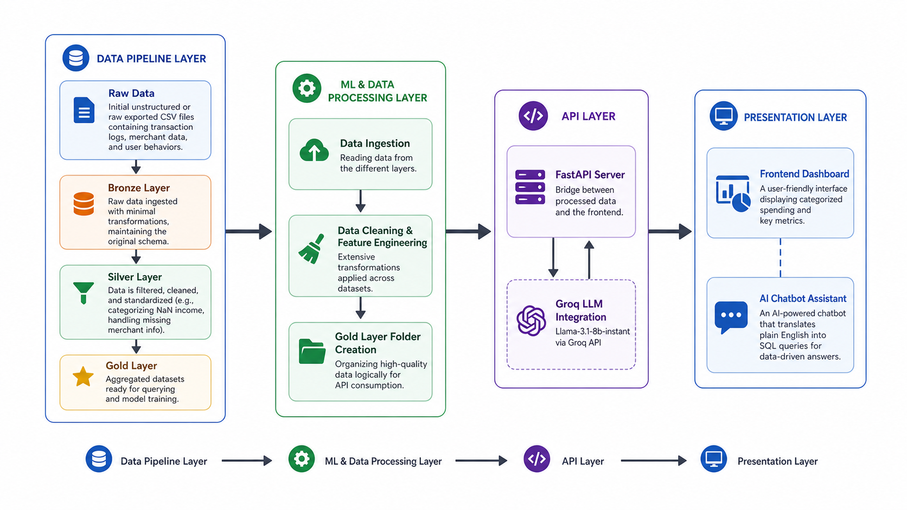
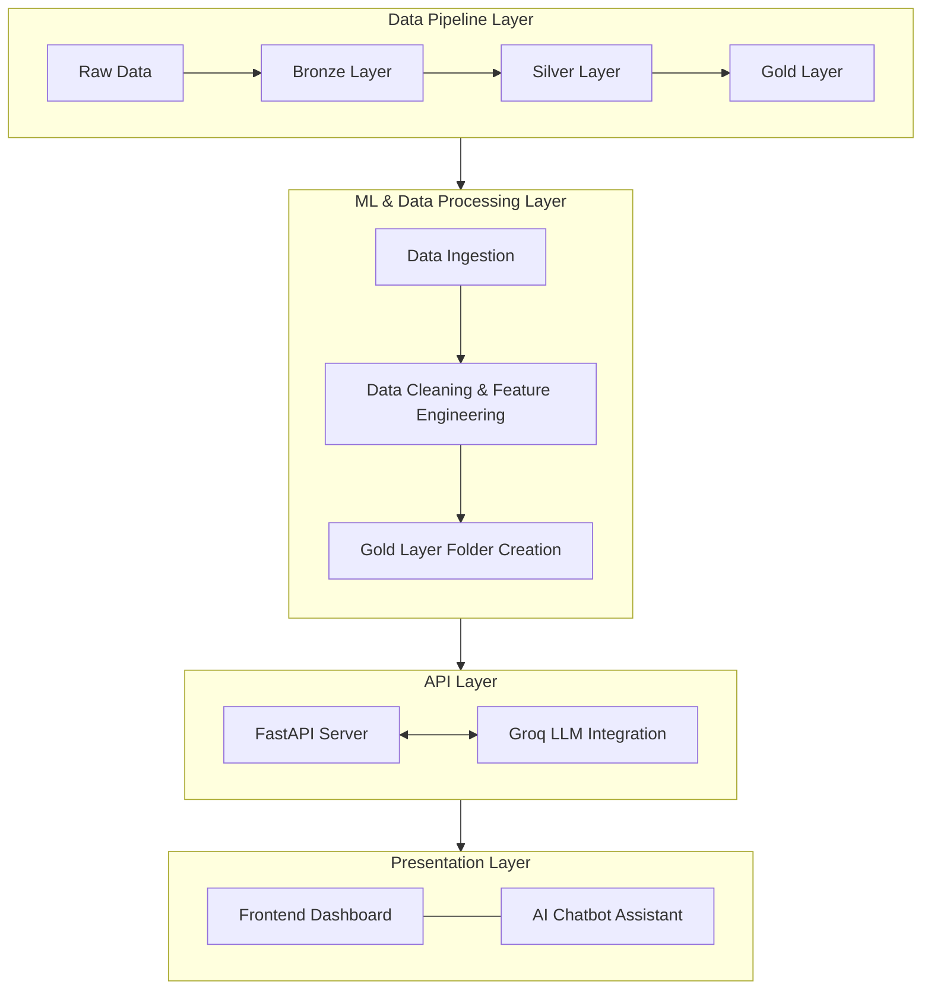

# Smart Transaction Ledger

## Description

Smart Transaction Ledger is an AI-powered financial transaction cleaner and fraud detector. It helps working professionals and small business owners automatically clean, categorize, and monitor their messy financial transaction data for fraud. This allows users to clearly understand their spending and detect suspicious activities without manual effort.

## Interface

https://github.com/user-attachments/assets/7a3e7fd6-6781-4963-9ec7-b0ce73eca2ec

---

## Architecture & Data Flow



<details>
<summary>Mermaid Diagram</summary>



</details>

---

**1. Data Pipeline Layer**
- **Raw Data**: Initial unstructured or raw exported CSV files containing transaction logs, merchant data, and user behaviors.
- **Bronze Layer**: Raw data ingested with minimal transformations, maintaining the original schema.
- **Silver Layer**: Data is filtered, cleaned, and standardized (e.g., categorizing NaN income, handling missing merchant info).
- **Gold Layer**: Aggregated datasets ready for querying and model training.

**2. ML & Data Processing Layer**
- **Data Ingestion**: Reading from the different layers.
- **Data Cleaning**: Extensive transformations applied across datasets.
- **Gold Layer Folder Creation**: Organizing high-quality data logically for API consumption.

**3. API Layer (FastAPI)**
- Bridge between processed data and the frontend.
- Loads the Gold dataset into an in-memory SQLite database on startup.

**4. Presentation Layer (Dashboard) & Chatbot**
- **Dashboard**: A user-friendly interface displaying categorized spending and metrics. 
- **Chatbot**: An AI-powered chatbot (Groq / Llama-3.1-8b-instant) that translates plain English into valid SQL queries for data-driven answers.

## Features
- **Automated Data Cleaning**: Transforms messy, unstructured transaction data into standardized, queryable formats using a robust Bronze -> Silver -> Gold pipeline.
- **Fraud Detection & Monitoring**: Identifies suspicious patterns, merchant risks, and anomalous user behaviors.
- **AI Chatbot Assistant**: Talk to your financial data using natural language, powered by Llama 3.1 via Groq.
- **Real-Time SQL Queries**: Converts conversational queries into SQLite commands dynamically on an in-memory database.
- **Interactive Dashboard**: View key spending insights, merchant risk levels, and user behaviors via a vanilla web interface.

## Installation

```bash
# Clone the repository
git clone https://github.com/Rudra-G-23/smart-transaction-ledger.git
cd smart-transaction-ledger

# Set up a virtual environment and install dependencies
# We use 'uv' in this project, but 'pip' works fine too.
uv venv
# On Windows use: .venv\Scripts\activate
# On macOS/Linux use: source .venv/bin/activate
.venv\Scripts\activate

uv pip install -r requirements.txt

# Set up your environment variables
# Create a .env file and add your Groq API key:
# GROQ_API_KEY=your_api_key_here
```

## Usage

1. **Run the FastAPI server:**
```bash
uvicorn main:app --reload
```
The API will start locally at `http://localhost:8000`.

2. **Open the Dashboard:**
Simply open `index.html` in your web browser to interact with the frontend and the AI chatbot.

3. **Data Processing (Optional):**
To see how the data was transformed, explore the Jupyter Notebooks inside the `notesbooks/` directory.

4. **API key for LLM Query:** 
   - [Hugging Face Repo](https://huggingface.co/spaces/Rudra-G-23/smart-transaction-ledger-api/tree/main)
   - [FastAPI Doc](https://rudra-g-23-smart-transaction-ledger-api.hf.space/docs)


## Tech Stack

- **Backend / API**: Python, FastAPI, Uvicorn
- **AI / LLM**: Groq API (Llama-3.1-8b-instant)
- **Data Processing**: Pandas, NumPy
- **Database**: SQLite (In-Memory)
- **Frontend**: HTML5, Vanilla CSS, JavaScript

## Folder Structure

```
smart-transaction-ledger/
├── data/                 # Data pipeline storage
│   ├── raw/              # Original unprocessed data
│   ├── bronze/           # Mildly transformed data
│   ├── silver/           # Cleaned and standardized data
│   └── gold/             # Aggregated, business-ready data
├── notesbooks/           # Jupyter notebooks outlining the ETL flow
├── src/                  # Additional Python scripts for data processing
├── .env                  # Environment variables (e.g., GROQ_API_KEY)
├── index.html            # Frontend Dashboard & Chat UI
├── main.py               # FastAPI application entry point
├── pyproject.toml        # Project metadata
└── requirements.txt      # Python dependencies
```

## Contributing

Pull requests are welcome. For major changes, please open an issue first to discuss what you would like to change.

## License

MIT License

## Author

**Rudra Prasad Bhuyan**  
Connect: https://rudra-g-23.github.io/
