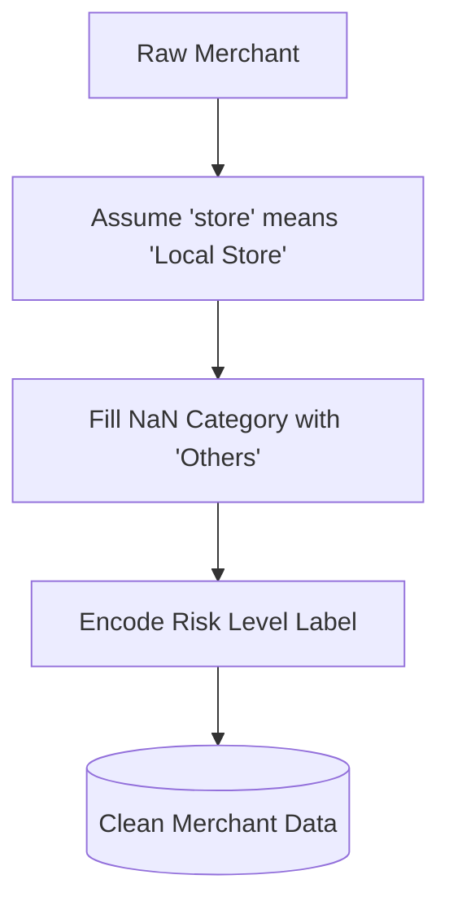
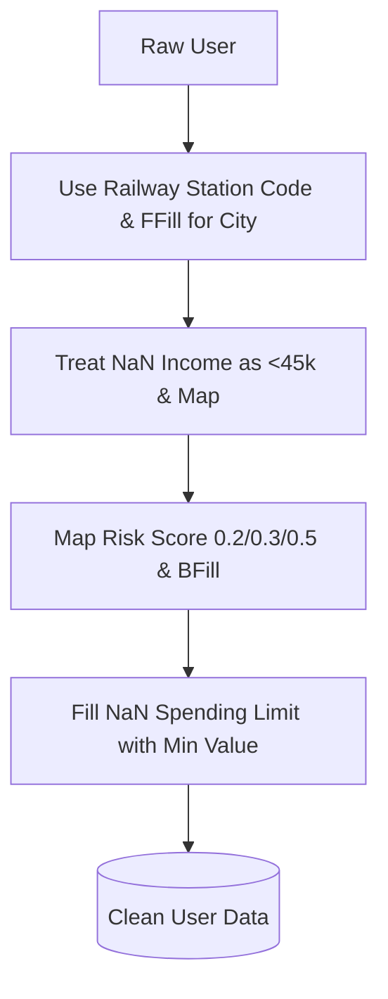
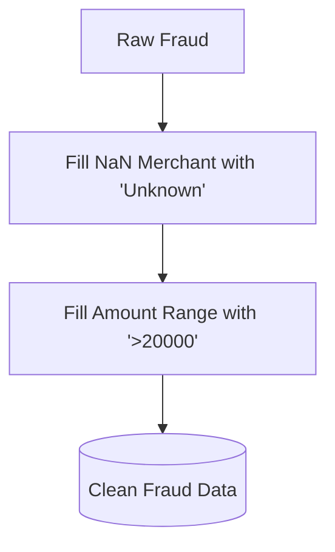
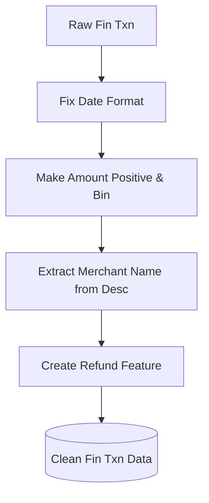

# Data Cleaning Process

## 1. Merchant

### 1.1.  Merchant Name
Assumptions:
- We don't know store means 
- That is the Local Store
  
### 1.2 expected_category
- Replace NaN value
- Fill nan with Others

### 1.3 risk_level
- Encoded the Label

---

## 2. User DB

### 2.1. City
- Used Railway Station Code
- Forward Filling

## 2.2. Income
- Nan value treat as the under 45k.
- Then Category the income group Mapping
  
## 2.3. risk score
- Map the risk score
- Low means 0.2, medium is 0.3 and high is 0.5
- Nan value fill with backward filling

## 2.4. Spending Limit
- Nan value fill with minimum value

---

## 3. Fraud Pattern

### 3.1 merchant
- NaN value fill with the Unknown

### 3.1 amount_range
- any that fill with >20000	

---

## 4. Fin Txn DB

### 4.1. Date
- Fix the date format

## 4.2. amount 
- Make everything +ve
- Using bins make the category
  
## 4.3. Desc
- From desc extract the Merchant name

## 4.4. category 
- Refund feature creation

---